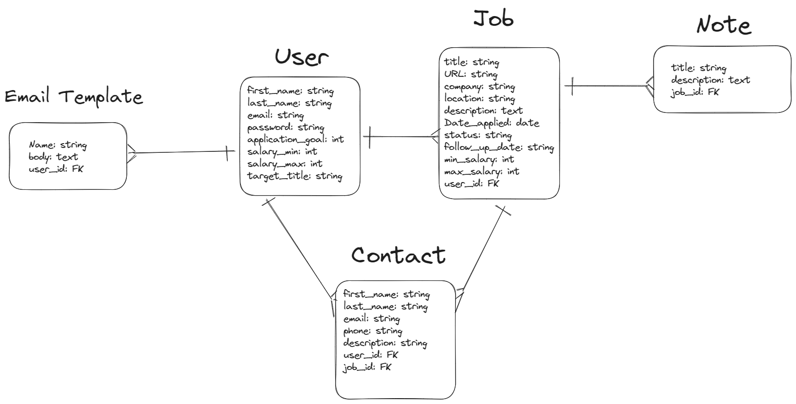
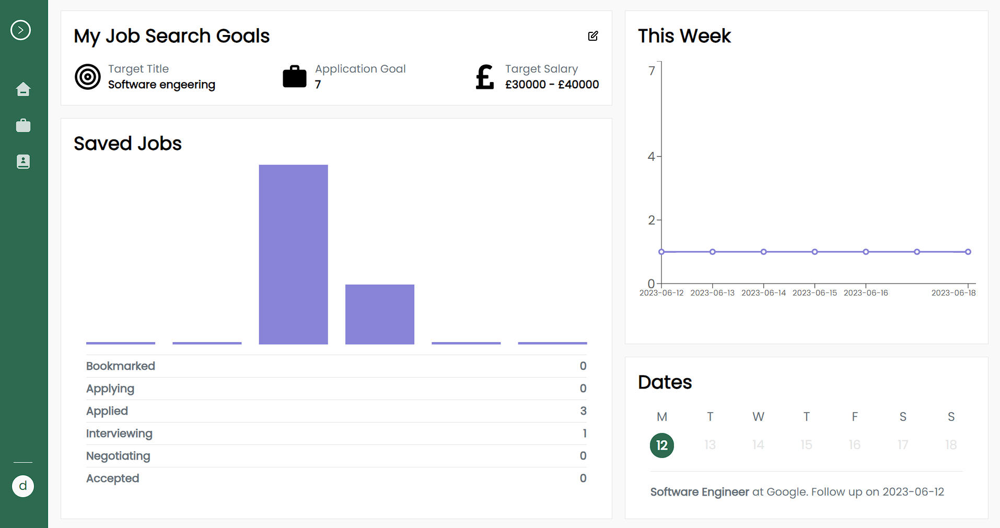

# Job tracker

Job tracker is an application that's designed to help people organise, manage and track their job applications throughout the hiring process. It provides centralized platform to keep all job-related information organized and easily accessible. This is a Full-Stack application using a Rails API with a React Front-End and was built in during the final two weeks of my Software Engineering Bootcamp with <a href="https://generalassemb.ly/education/software-engineering-immersive/london">General Assembly</a>.

### **Deployment link** : https://job-tracer.netlify.app/

### Login as the Demo User:

**Email**: demo@gmail.com
**Password**: 123456

# Getting Started/Code installation

If you would like to Clone and run this project on your machine follow these steps:

1. Clone and navigate into this Repo and run `$npm install` to install all dependencies
2. start the development server with `$npm start`
3. Clone and navigate into the backend repo from this <a href="https://github.com/maxim-pre/job-tracker-back">Link</a>
4. Before you can migrate the database you will need to add your username and password for PSQL in config/database.yml
5. run `$rails db:create db:migrate `
6. run `$rails s` to start the development server
7. Finish!

# Technologies Used

### Stack

- **Rails**
- **React**
- **PostgreSQL**
- **Tailwind CSS**
- **JavaScript**
- **Ruby**

### Npm Packages

- **React Quill** (used for the text editors)
- **React-Modal** (used for all Modal components)
- **ReCharts** (used to Create bar and line charts)
- **React-Toasify** (used for the notification pop-ups)
- **React-Router**
- **React-Icons**
- **Axios** (HTTP client)

### Gems

- **Devise** (Gem used to implement user authentication)
- **Devise-JWT** (Devise extension to use JWT tokens for Authentication)

### Developer tools

- **Postman**
- **Github**
- **VScode**
- **Pesticide**

# Technical requirements

- Have a minimum of two models
- Use Authentication
- Have full CRUD on at leasy one model
- Be able to create and destroy and secondary models
- quality code:
- Main point 1
  - Follow naming conventions
  - Consitent indentation
  - well-structured and readable code
  - semantic naming
  - consice functions
  - efficient code
  - DRY (do no repeat) code
- Application must be deployed
- include README.md file

# planning

## User Stories

- As a user I should be able to create an account and include goals such as target salary, application goals and target titlle so I can stay on track

- As a user I should be able to log jobs I'm thinking of applying for so I can track their progress

- As a user I should be able to view all my jobs in one place so I can be easily reminded of all the jobs I've logged

- As a user I should be able to filter through all my jobs by status so for example I could see all the jobs I'm yet to apply for

- As a user I should be able to make notes for a job application so that they are easily accessible whenever I come back to it.

- As a user I should be able to update the status of a job so I can record my progress.

## Stretch Goals

- As a user I should be able to save email templates such as a follow up email template so they can easily be accessed later when I need them.

- As a user I should be able to record contacts for a job application so I have a record of all relevant people in case I want to contact them later.

## Entity Relationship Diagram



## Wireframe

https://www.figma.com/file/gKHg3tLKOQoeTzkwTcxe3j/Figma-basics?type=design&node-id=0%3A1&t=hSP8Sd66EpJhHUGA-1

# Build/Code Process

## Back-end

Starting off with building the Rails API, my first goal was to implement my User modal as Well as routes and controllers to handle Logging in, Logging out, Signing up, ect. To do this I created a Devise User modal and Used Devise-JWT to configure authentication using JWT-tokens.

Devise-JWT comes with three authentication strategies, and I chose the one that involves storing a single valid user-attached token called a JTI (JWT ID) for each user in the Users table.

This is How I included the strategy into the user model

```ruby
include Devise::JWT::RevocationStrategies::JTIMatcher
```

```ruby
  create_table "users", force: :cascade do |t|
    t.string "email", default: "", null: false
    t.string "encrypted_password", default: "", null: false
    t.string "reset_password_token"
    t.datetime "reset_password_sent_at"
    t.datetime "remember_created_at"
    t.datetime "created_at", null: false
    t.datetime "updated_at", null: false
    t.string "jti", null: false
    t.string "first_name"
    t.string "last_name"
    t.integer "application_goal", default: 5
    t.integer "salary_min", default: 0
    t.integer "salary_max", default: 0
    t.string "target_title"
    t.index ["email"], name: "index_users_on_email", unique: true
    t.index ["jti"], name: "index_users_on_jti", unique: true
    t.index ["reset_password_token"], name: "index_users_on_reset_password_token", unique: true
  end
```

You Can see the Users table I've added a column called JTI. Whenever a token is dispached for a user the JTI claim is taken from the user model. When a user logs out thier JTI is changed so the token won't be valid anymore. I chose this strategy because it reduces the risk of multiple valid tokens at a given time, because the JTI changes whenever a user Session has terminated.

To tell devise to communicate with JSON I created a Registrations and a sessions Controller. The registrations controller handles operations such as creating and updating a user while the sessions controller handles operations such as signing in logging out.

```ruby
class Users::SessionsController < Devise::SessionsController
  include RackSessionFix
  respond_to :json

  private

  def respond_with(resource, _opts = {})
    render json: {
      status: {code: 200, message: 'Logged in sucessfully.'},
      data: UserSerializer.new(resource).serializable_hash[:data][:attributes]
    }, status: :ok
  end

  def respond_to_on_destroy
    if current_user
      render json: {
        status: 200,
        message: "logged out successfully"
      }, status: :ok
    else
      render json: {
        status: 401,
        message: "Couldn't find an active session."
      }, status: :unauthorized
    end
  end
end

class Users::RegistrationsController < Devise::RegistrationsController
  include RackSessionFix
  respond_to :json
  before_action :configure_sign_up_params, only: [:create]
  before_action :configure_account_update_params, only: [:update]

  def respond_with(resource, _opts = {})
    if request.method == "POST" && resource.persisted?
      render json: {
        status: { code: 200, message: "Signed up successfully." },
        data: UserSerializer.new(resource).serializable_hash[:data][:attributes]
      }, status: :ok
    elsif request.method == "DELETE"
      render json: {
        status: { code: 200, message: "Account deleted successfully." }
      }, status: :ok
    elsif request.method == "PATCH" && resource.persisted?
      if update_user_without_password(resource, account_update_params)
        render json: {
          status: { code: 200, message: "Account updated successfully." },
          data: UserSerializer.new(resource).serializable_hash[:data][:attributes]
        }, status: :ok
      else
        render json: {
          status: { code: 422, message: "User couldn't be updated successfully. #{resource.errors.full_messages.to_sentence}", errors: resource.errors }
        }, status: :unprocessable_entity
      end
    else
      render json: {
        status: { code: 422, message: "User couldn't be created successfully. #{resource.errors.full_messages.to_sentence}", errors: resource.errors }
      }, status: :unprocessable_entity
    end
  end

  private

  def configure_sign_up_params
    devise_parameter_sanitizer.permit(:sign_up, keys: [:first_name, :last_name, :target_title, :salary_min, :salary_max])
  end

  def configure_account_update_params
    devise_parameter_sanitizer.permit(:account_update, keys: [:first_name, :last_name, :target_title, :salary_min, :salary_max, :application_goal])
  end

  def update_resource(resource, params)
    resource.update_without_password(params)
  end

  def bypass_sign_in(resource, scope=nil)

  end

  def update_user_without_password(resource, params)
    if params[:password].blank? && params[:password_confirmation].blank?
      params.delete(:password)
      params.delete(:password_confirmation)
      resource.update_without_password(params)
    else
      resource.update(params)
    end
  end
end
```

Next it was time to start implementing the other models into the API. These included; Jobs, Notes, Contacts, Interviews. These were much more straight foreward to implement and I used the following process.

1. Generate the model in rails passing in all related fields from the ERD
2. Create new routes in Routes.rb file to handle requests on the new model

```ruby
resources :jobs do
    resources :interviews
    resources :notes
  end
  resources :contacts
```

3. create a controller to handle all requests to the routes specified in the routes folder. For example, the code snippet below shows how I handled post request to create a new job.

```ruby
def create
        @job = Job.new(job_params)
        @job.user_id = current_user.id

        if @job.save
            render json: {status: 'SUCCESS', message: 'job is saved', data:@job }, status: :ok
        else
            render json: {status: 'Error', message: 'error saving job', data:@job.errors}, status: :unprocessable_entity
        end

    end
```

## Front-end

After creating the react app with `$npx create react-app`. I wanted to start of by making it possible for a user to create and account, login and Logout.

I started by creating the following axios instance:

```javascript
const authAxios = axios.create({
  baseURL: "http://localhost:4000",
  headers: {
    Authorization: `${localStorage.getItem("token")}`,
  },
});
```

I would be using this for all requests to authenticated endpoints because it will automatically crab the JWT token from local storage whenever it's called.

Next I started creating the forms which are essentially a collection of the formInput component

```javascript
const FormInput = ({ placeholder, type, value, onChange, errors, name }) => {
  return (
    <div>
      <input
        className={`my-4 rounded-sm  focus:outline-0 border border-gray py-2 px-1 focus:ring-1 focus:ring-gray-300 focus:ring-opacity-40 placeholder:text-sm text-sm w-full ${
          (errors && errors[name]) || (errors && typeof errors === "string")
            ? "border-error ring-error"
            : ""
        }`}
        type={type}
        value={value}
        placeholder={placeholder}
        onChange={(e) => onChange(e.target.value)}
        id={name ? name : ""}
      ></input>
      {errors[name] && (
        <FormError label={placeholder} message={errors[name][0]} />
      )}
    </div>
  );
};
```

After Creating the forms I wrote the submit functions to make the calls to the api.

to Login:

```javascript
const submit = async () => {
  const user = {
    email: email,
    password: password,
  };
  try {
    const response = await axios.post(`${apiRoute}login`, { user: user });
    localStorage.setItem("token", response.headers.authorization);
    setError("");
    window.location.href = "/";
  } catch (error) {
    console.log(error);
    setError(error.response.data);
  }
};
```

To Sign up:

```javascript
const submit = async () => {
  const user = {
    email: email,
    password: password,
    first_name: firstName,
    last_name: lastName,
  };
  try {
    const response = await authAxios.post(`${apiRoute}signup`, {
      user: user,
    });
    localStorage.setItem("token", response.headers.authorization);
    setErrors("");
    window.location.href = "/";
  } catch (error) {
    setErrors(error.response.data.status.errors);
  }
};
```

After implementing User login, signup, logout on the front-end I could now focus on the main feature of the application, the job tracker.

The job tracker page is essentially one big table, where the user can perform full CRUD on the jobs. If a user Selects one of the jobs, they are redirected to a more detailed page about that specific job.

Here are the columns of the jobs table

```javascript
const columns = [
  {
    key: "select",
    content: (job) => (
      <input
        type="checkbox"
        checked={selectedJobIds.includes(job.id)}
        onChange={() => onSelectJob(job.id)}
      />
    ),
  },
  { path: "title", label: "Title", link: navigateToJob },
  { path: "company", label: "Company", link: navigateToJob },
  { path: "location", label: "Location", link: navigateToJob },
  { path: "max_salary", label: "Max Salary", link: navigateToJob },
  { path: "status", label: "Status", link: navigateToJob },
  { path: "date_applied", label: "Date Applied", link: navigateToJob },
];
```

I created a generic table header and table body component to extract all reusable logic. Because I planned to Have another table to store all the users contacts.

```javascript
<table className="table-auto w-full">
  <TableHeader columns={columns} onSort={onSort} sortColumn={sortColumn} />
  <TableBody columns={columns} data={jobs} />
</table>
```

Here's the table header where I'm rendering the column labels, aswell as a sort icon depending on if the column is selected and whether is descending or ascending.

```jsx
<thead>
  <tr className="">
    {columns.map((col) => {
      return (
        <th
          key={col.path ? col.path : col.key}
          onClick={() => raiseSort(col.path)}
          className={`${
            col.content
              ? "border-r border-lightgray"
              : "border-r border-l border-gray"
          } bg-lightgray text-sm font-bold hover:bg-lightgray `}
        >
          <div className="flex items-center py-4 px-4 justify-center">
            {renderSortIcon(col)}
            {col.label}
          </div>
        </th>
      );
    })}
  </tr>
</thead>
```

The table body renders each cell using the function below.

```javaScript
import _ from 'lodash'

  const getContent = (item, column) => {
    const content = _.get(item, column.path);
    if (typeof content === "string") {
      return content.charAt(0).toUpperCase() + content.slice(1);
    } else {
      return content;
    }
  };
```

```javascript
const renderCell = (item, column) => {
  if (column.content) return column.content(item);
  return getContent(item, column);
};
```

First I'm checking if the column has a key called content. Content is a key the maps to a function that takes the item as an argument. In my case, One of the columns of the jobs table is a checkbox, so to render the checkbox im calling the functions stored under the key 'content'.

to handle linking to the job when the user clicks on the table row, you mak have noticed the 'link' key in the columns object. Here I'm referencing a function that calls when a user clicks on the cell.

```javascript
const navigate = useNavigate();
const navigateToJob = (job) => {
  navigate(`/jobtracker/${job.id}`);
};
```

Then on the table cell I have this code:

```Javascript
onClick={col.link ? () => col.link(item) : undefined}
```

Lastly I want to go over How I implemented the charts on the dashboard using ReCharts.

For the bar and line chart components, they both take in a 'data' argument which is a list of objects with each key representing a point on the Xaxis and value is the corresponding point on the Yaxis.

For the line chart I used the function below to create a list of 7 objects, with each key represending the date of the current week (Mon-Sun).

```javascript
const generateDataForCurrentWeek = () => {
  const currentDate = new Date();
  const currentDay = currentDate.getDay();
  const days = [];
  const startDayOffset = currentDay === 0 ? -6 : 1 - currentDay;

  for (let i = startDayOffset; i < startDayOffset + 7; i++) {
    const date = new Date(
      currentDate.getFullYear(),
      currentDate.getMonth(),
      currentDate.getDate() + i
    );
    const day = `${date.getFullYear()}-${
      date.getMonth() + 1 < 10
        ? "0" + (date.getMonth() + 1).toString()
        : date.getMonth() + 1
    }-${date.getDate() < 10 ? "0" + date.getDate() : date.getDate()}`;
    days.push({ day: day, applications: 0 });
  }
  return days;
};
```

To make each date with the users Job applications that week I made this function.

```javascript
let total = 0;
data.forEach((day) => {
  jobs.forEach((job) => {
    if (job.date_applied === day.day) total += 1;
    day.applications = total;
  });
});
```

# Challenges

Overall I felt pretty confortable with the front-end portion of the project as React is a framework I was familiar with. On the other hand this was my first project using Rails and and was a challenging learning experience. I found that Rails does a lot of "magic" behing the scences so I found debugging confusing because I often couldnt find the root of the issue. For example, when I trying to handle updating a user in the registrations controller I kept getting the error "Can't update user password required". I eventually solved this by adding the method "update_user_without_password" but was it was a nightmare to figure out what was going wrong.

# Wins

Overall I'm very pleased with how the app has turned out and I was able to implement the core functionality of the app within the project timeframe. I am especially pleased with the UI. For example, I think i've made great usage of screen space on the dashboard and I think each componenent has a clear purpose and is useful to the user.



# Key Learnings/Takeaways

Perhaps one of the main learning experiences for me was state management and dataflow. This was something I overlooked during the planning phase and probably would've saved be a couple headaches down the road. For example, in my app.js component I fetched all jobs for the logged in user, but when a user selects a job I make another get request to fetch the job based on the Job id passed in the url. This was not only an unecessary API call since I could've passed down the data from the app component, it complecated managing the state of the application. With this implementation whenever I updated a job I would have to call a function to update the state in the app.js component. Going foreward this is something I will plan in future projects.

# Bugs

The app is fully responsive, although there is a bug where the graphs won't render if the dashboard is rendered on a small screen. Although if the dashboard is rendered on a large screen but is then scaled down to a small screen the graphs appear just fine. this is something I will definately be fixing soon.

# Future Improvements

There are a few features that I planned to add but did not have enough time to complete within the project timeframe.

1. Contacts - I planned to add a page where users can keep track of all job related contacts stored in a table similar to the job tracking table

2. Interview tracking - I feature where users can keep track of interview within a job application. Users can add details like the type of interview, make note and add the contacts of their interviewers.
